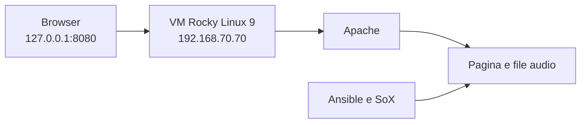

# DEVOPS EVERYWHERE

Progetto Vagrant che crea una macchina virtuale **Rocky Linux 9** e utilizza **Ansible** per configurare un piccolo server web musicale.

La pagina permette di ascoltare due melodie generate con **SoX**:

- scala di La minore;
- scala di La maggiore.

> [!NOTE]
> **Vagrant** crea la macchina virtuale. **Ansible** installa e configura i programmi necessari.

| Tecnologia    | Utilizzo                            |
| ------------- | ----------------------------------- |
| Vagrant       | Creazione della macchina virtuale   |
| VirtualBox    | Esecuzione della VM                 |
| Ansible       | Configurazione automatica           |
| Rocky Linux 9 | Sistema operativo della VM          |
| Apache        | Pubblicazione della pagina web      |
| SoX           | Creazione e modifica dei file audio |
| Firewalld     | Apertura del servizio HTTP          |

## Funzionamento



Il flusso del progetto è il seguente:

1. Vagrant crea la VM Rocky Linux 9;
2. Vagrant avvia il provisioning Ansible;
3. Ansible installa Apache, SoX e Firewalld;
4. SoX genera le note e crea le due melodie;
5. Apache pubblica la pagina HTML e i file audio.

## Vagrantfile

Il `Vagrantfile` definisce la macchina virtuale:

```ruby
config.vm.box = "generic/rocky9"
config.vm.hostname = "devops-es1"
config.vm.network "private_network", ip: "192.168.70.70"
```

La VM utilizza:

- 1 CPU;
- 1 GB di RAM;
- indirizzo IP privato `192.168.70.70`.

### Port forwarding

```ruby
config.vm.network "forwarded_port",
  guest: 80,
  host: 8080,
  host_ip: "127.0.0.1"
```

La porta `8080` del Mac viene collegata alla porta `80` della VM:

```text
127.0.0.1:8080 → VM:80 → Apache
```

### Provisioning

```ruby
config.vm.provision "ansible" do |ansible|
  ansible.playbook = "rocky9setup.yml"
end
```

Durante `vagrant up`, viene eseguito automaticamente il playbook Ansible.

## Playbook Ansible

Il file `rocky9setup.yml` esegue la configurazione della VM con privilegi amministrativi:

```yaml
hosts: all
become: yes
gather_facts: false
```

### Installazione dei pacchetti

Il modulo `dnf` installa:

- `httpd`, il server web Apache;
- `sox`, il programma che genera i file audio;
- `firewalld`, il firewall di Rocky Linux.

### Avvio dei servizi

Il modulo `service` avvia Apache e Firewalld:

```yaml
state: started
enabled: yes
```

- `started`: avvia subito il servizio;
- `enabled`: lo avvia automaticamente al boot.

Il modulo `firewalld` abilita il traffico HTTP sulla porta 80.

## Creazione delle melodie

SoX genera ogni nota partendo dalla sua frequenza:

```bash
sox -n -r 44100 -c 2 la.wav synth 1 sine 440
```
- `-n` crea un suono senza usare un file di ingresso;
- `-r 44100` imposta la frequenza di campionamento;
- `-c 2` crea un file stereo;
- `synth 1` genera un secondo di audio;
- `sine 440` crea un'onda sinusoidale a 440 Hz, cioè la nota La.

Le singole note vengono poi unite per formare una melodia:

```bash
sox la.wav si.wav do.wav re.wav mi.wav fa.wav sol.wav la2.wav lam.wav
```

Infine viene aggiunto il riverbero:

```bash
sox lam.wav lamrev.wav reverb 80 50 100 gain -n -3
```

I file finali sono:

- `lamrev.wav`: scala di La minore;
- `laMrev.wav`: scala di La maggiore.

## Pagina web

Ansible crea il file:

```text
/var/www/html/index.html
```

La pagina contiene due pulsanti. La funzione JavaScript assegna al lettore il file scelto e avvia la riproduzione:

```javascript
function playMelodia(melodia) {
  const audio = document.getElementById('melodiaPlayer');
  audio.src = melodia;
  audio.play();
}
```

## Avvio

Dalla cartella del progetto:

```bash
vagrant up
```

Aprire nel browser:

```text
http://127.0.0.1:8080
```

