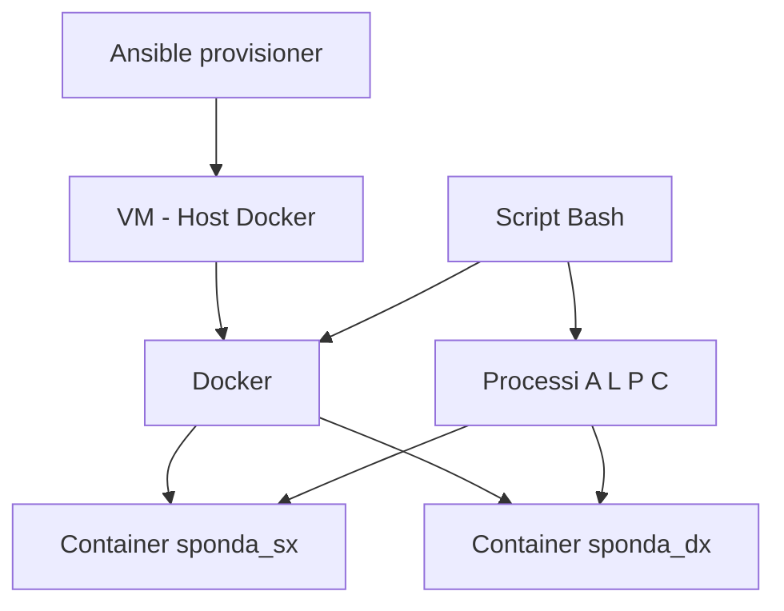

<h1 align="center">LUPO PECORA E CAVOL-OPS</h1>

<h2 align="center">UTILIZZO</h2>

Un allevatore deve portare dall'altro lato di un fiume tre attori:

- `L` = Lupo
- `P` = Pecora
- `C` = Cavolo

La barca può trasportare l'**Allevatore** e solo **un altro attore** alla volta.

Se l'Allevatore non è assieme agli attori e li lascia da soli su una riva:

>[!WARNING] 
>- il **lupo** mangia la **pecora**;
>- la **pecora** mangia il **cavolo**.

> [!NOTE]
> Il lupo è un attore attivo verso la pecora.  
> La pecora è attiva verso il cavolo e passiva verso il lupo.  
> Il cavolo è un attore passivo.

## _Obiettivo_

Portare tutti e tre gli attori dall'altra parte del fiume integri.

```text
A = Allevatore
L = Lupo
P = Pecora
C = Cavolo
```

## _Stato iniziale_

```text
Sponda sinistra: A L P C
Sponda destra:
```

## _Stato finale desiderato_

```text
Sponda sinistra:
Sponda destra: A L P C
```

## _Soluzione logica_

Il problema è risolvibile in **7 passaggi**.

```text
1. A + P --> destra
2. A     --> sinistra
3. A + L --> destra
4. A + P --> sinistra
5. A + C --> destra
6. A     --> sinistra
7. A + P --> destra
```

> [!IMPORTANT]
> La pecora è l'attore più importante da controllare, perché può essere mangiata dal lupo ma può anche mangiare il cavolo.

---

# _Schema architetturale_

Per svolgere l'esercizio vengono utilizzati:

| Elemento | Ruolo |
|---|---|
| `VM` | Host su cui gira Docker |
| `Ansible` | Provisioner che installa Docker e copia lo script |
| `Docker` | Gestisce i container |
| `script Bash` | Orchestratore del gioco |
| `sponda_sx` | Container della sponda sinistra |
| `sponda_dx` | Container della sponda destra |
| `A L P C` | Processi che rappresentano gli attori |



## _Procedimento_

Tramite un playbook Ansible eseguito come provisioner viene installato Docker sulla VM.

Successivamente viene copiato lo script Bash come comando sulla VM
Quando il comando `Lupo_v3` viene richiamato questo crea due container Docker:

- `sponda_sx`
- `sponda_dx`

I container rappresentano le due rive del fiume.

Lo script quindi crea quattro processi, uno per ogni attore:

```text
A L P C
```

All'inizio i quattro processi partono nel container `sponda_sx`.

In base alle scelte dell'utente, i processi vengono terminati su un container e riavviati sull'altro, simulando il passaggio da una sponda all'altra.


> [!IMPORTANT] 
> Gli attori del gioco sono processi Linux `sleep infinity` avviati dentro i container Docker.


Qualora l'utente vada contro le regole del gioco e lasci su una sponda:

- `L + P` senza Allevatore;
- `P + C` senza Allevatore;

lo script interrompe la partita e stampa `GAME OVER`.

Quando tutti gli attori arrivano sulla sponda destra rispettando le regole, l'utente vince.

---

# _Struttura del programma_

1. Definizione colori e variabili
2. Creazione dei container
3. Avvio dei processi
4. Visualizzazione delle sponde
5. Input dell'utente
6. Controllo della scelta
7. Spostamento degli attori
8. Verifica sconfitta
9. Verifica vittoria
10. Ripetizione del ciclo

---

## _1 - Variabili principali_

```bash
SPO_SX="sponda_sx"
SPO_DX="sponda_dx"

A="sinistra"
L="sinistra"
P="sinistra"
C="sinistra"
```

`SPO_SX` e `SPO_DX` contengono i nomi dei container.

`A`, `L`, `P`, `C` contengono invece la posizione degli attori.

All'inizio tutti si trovano sulla sponda `sinistra`.

---

## _2 - Funzione inizializza_container_

Questa funzione prepara l'ambiente del gioco.

```bash
inizializza_container(){
    docker rm -f "$SPO_SX" "$SPO_DX" >/dev/null 2>&1 

    docker run -dit --name "$SPO_SX" ubuntu:22.04 bash >/dev/null
    docker run -dit --name "$SPO_DX" ubuntu:22.04 bash >/dev/null

    for attore in A L P C; do
        start_process "$attore"
    done
}
```

Prima elimina eventuali vecchi container, poi crea le due sponde e infine avvia i processi degli attori.
I container vengono creati da un'immagine di ubuntu.


> [!TIP] 
> `docker rm -f` serve per eliminare i container erano già presenti da una partita precedente.
> `docker run -dit --name` crea un container in background con terminale interattivo ed un nome specificato dopo l'apposita flag


---

## _3 - Funzione lista_sponda_

Questa funzione mostra quali attori si trovano su una determinata sponda.

```bash
lista_sponda(){
    sponda="$1"
    lista=

    for attore in A L P C; do
        if [ "$(verifica_posizione "$attore")" = "$sponda" ]; then
            lista="$lista $attore"
        fi
    done

    echo "$lista"
}
```

Viene usata dalla funzione `mostra_stato` per stampare la situazione aggiornata del gioco.

---

## _4 - Funzione verifica_posizione_

Questa funzione controlla dove si trova un attore. Stampa il valore della variabile posizionale corrispondente ad ogni attore.

```bash
verifica_posizione(){
    case "$1" in
        A|a) echo "$A" ;;
        L|l) echo "$L" ;;
        P|p) echo "$P" ;;
        C|c) echo "$C" ;;
    esac
}
```


---

## _5 - Funzione mostra_stato_

Questa funzione stampa a schermo lo stato delle due sponde.

```bash
mostra_stato(){
    echo -e "Sponda sinistra:$(lista_sponda sinistra)"
    echo -e "~~~~~~~~~ FIUME ~~~~~~~~~"
    echo -e "Sponda destra:$(lista_sponda destra)"
}
```


---

## _6 - Funzione altra_sponda_

Questa funzione restituisce la sponda opposta a quello dove si trova l'attore che viene inserito come argomento. Serve per la funzione `sposta attore`

```bash
altra_sponda(){
    if [ "$1" = "sinistra" ]; then
        echo "destra"
    else
        echo "sinistra"
    fi
}
```

Serve per capire dove deve arrivare l'attore durante lo spostamento.

---

## _7 - Funzioni start_process e ferma_processo_

Ogni attore viene rappresentato da un processo Linux `sleep infinity`

>[!TIP] 
>La funzione `start_process` avvia il processo nel container corretto.


```bash
start_process(){
    attore="$1"
    sponda=$(verifica_posizione "$attore")
    container=$(container_sponda "$sponda")

    docker exec "$container" bash -c "nohup bash -c 'exec -a $attore sleep infinity' >/dev/null 2>&1 & echo \$! > /tmp/$attore.pid"
}
```

Il comando `exec -a` permette di dare al processo il nome dell'attore.

>[!TIP] 
>La funzione `ferma_processo` termina invece il processo quando l'attore lascia una sponda.

```bash
ferma_processo(){
    attore="$1"
    sponda="$2"
    container=$(container_sponda "$sponda")

    docker exec "$container" bash -c "if [ -f /tmp/$attore.pid ]; then kill \$(cat /tmp/$attore.pid) 2>/dev/null; rm -f /tmp/$attore.pid; fi"
}
```

> [!NOTE] 
> Il PID del processo viene salvato in `/tmp/$attore.pid`, così lo script sa quale processo deve fermare.

---

## _8 - Funzione container_sponda_

Questa funzione collega il nome logico della sponda al container Docker corretto.

```bash
container_sponda(){
    if [ "$1" = "sinistra" ]; then
        echo "$SPO_SX"
    else
        echo "$SPO_DX"
    fi
}
```

Quindi:

```text
sinistra --> sponda_sx
destra   --> sponda_dx
```

---

## _9 - Funzione modifica_posizione_

Questa funzione aggiorna la posizione dell'attore dopo lo spostamento.

```bash
modifica_posizione(){
    case "$1" in
        A|a) A="$2" ;;
        L|l) L="$2" ;;
        P|p) P="$2" ;;
        C|c) C="$2" ;;
    esac
}
```

Se la pecora passa a destra, la variabile `P` diventa:

```bash
P="destra"
```

---

## _10 - Funzione sposta_attore_

Questa funzione è il cuore del programma.

```bash
sposta_attore(){
    attore="$1"

    sponda_origine=$(verifica_posizione "$attore")
    sponda_fine=$(altra_sponda "$sponda_origine")

    ferma_processo "$attore" "$sponda_origine"
    modifica_posizione "$attore" "$sponda_fine"
    start_process "$attore"
}
```

Quando un attore attraversa il fiume:

1. viene fermato il suo processo nella sponda di partenza;
2. viene aggiornata la sua posizione;
3. viene avviato un nuovo processo nella sponda di arrivo.

---

## _11 - Funzione verifica_input_

Questa funzione controlla che l'utente abbia inserito una scelta valida.

```bash
verifica_input() {
    case "$1" in
        ""|l|L|p|P|c|C) 
        return 0
        ;;
        *)
        return 1
        ;;
    esac
}
```

Sono validi:

```text
L/l     = Lupo
P/p     = Pecora
C/c     = Cavolo
INVIO   = solo Allevatore
```

> [!WARNING]
> L'attore scelto può essere trasportato solo se si trova sulla stessa sponda dell'Allevatore.

---

## _12 - Funzione contiene_

Questa funzione verifica se un attore si trova su una specifica sponda.

```bash
contiene(){
    attore="$1"
    sponda="$2"

    [ "$(verifica_posizione "$attore")" = "$sponda" ]
}
```

Viene usata nella funzione `verifica_lost`.

---

## _13 - Funzione verifica_lost_

Questa funzione controlla le condizioni di sconfitta.

```bash
verifica_lost(){
    for sponda in sinistra destra; do
        if ! contiene A "$sponda"; then
            if contiene L "$sponda" && contiene P "$sponda"; then
                echo "GAME OVER"
                exit 1
            fi
            if contiene P "$sponda" && contiene C "$sponda"; then
                echo "GAME OVER"
                exit 1
            fi
        fi
    done
}
```

Il controllo viene fatto su entrambe le sponde grazie a un ciclo for.

Se manca l'Allevatore e rimangono insieme `L + P` oppure `P + C`, la partita finisce.

---

## _14 - Funzione verifica_vict_

Questa funzione controlla la vittoria.

```bash
verifica_vict(){
    if [ "$A" = "destra" ] && [ "$L" = "destra" ] && [ "$P" = "destra" ] && [ "$C" = "destra" ]; then
        echo "HAI VINTO!"
        exit 0
    fi
}
```

La vittoria avviene quando tutti gli attori si trovano sulla sponda destra.

---

# _Ciclo principale_

Il ciclo `while true` mantiene il gioco attivo fino alla vittoria, alla sconfitta o all'uscita volontaria.

```bash
while true; do
    mostra_stato
    read -r scelta

    sposta_attore A

    if [ -n "$scelta" ]; then
        sposta_attore "$scelta"
    fi

    verifica_lost
    verifica_vict
done
```

Ad ogni turno:

1. viene mostrato lo stato delle sponde;
2. l'utente sceglie chi portare;
3. l'Allevatore si muove sempre;
4. se è stato scelto un attore, si muove anche quell'attore;
5. vengono controllate sconfitta e vittoria.

> [!IMPORTANT]
> Premendo solo `INVIO`, si sposta soltanto l'Allevatore.

---
